# Arte de referencia

Lo genera `tools/exportar_arte.gd` a partir del dibujo por código.
Esta carpeta **no es** la que lee el juego: es el punto de partida
para redibujar. Lo que sustituye de verdad va en `arte/`.

## Cómo entregar un dibujo

1. El **nombre del fichero manda**. `abeja.png` sustituye a la abeja;
   cualquier otro nombre no lo lee nadie.
2. Se deja en `arte/targets/` o `arte/fondos/` según sea forma o fondo.
3. PNG con transparencia, SVG, WebP o JPG. Nada más que hacer: el juego
   lo coge al arrancar, y si lo quitas vuelve el dibujo de código.

### El lienzo de un target

El lienzo mide **5.4 radios de ancho** y la forma va centrada, ocupando
el tercio central. El aire de alrededor no sobra: el cordel del globo
llega a 2.65 radios y las aletas del misil a 1.35, y sin margen se
recortaría justo el detalle que las identifica.

Estas referencias salen a 512 x 512 px. Vale cualquier tamaño mientras
sea cuadrado y respete esa proporción; si no, la forma saldrá de otro
tamaño que las demás.

### El color

Un asset se dibuja **tal cual**. No se tiñe con la paleta del bioma, así
que el color lo eliges tú. Abajo está la paleta de cada bioma por si
quieres seguirla.

### Lo que se pierde

Cinco formas se animan por dentro y al sustituirlas quedan **quietas**:
las alas de la abeja, la cola del pez, el titileo de la estrella, el
ondeo de la llama y el cordel del globo. Una imagen no bate alas. No es
un fallo, es lo que cuesta cambiar código por imagen; conviene decidirlo
a conciencia en esas cinco. Lo que **no** se pierde: el giro hacia la
dirección de vuelo y la animación de aparición.

## Targets

<table>
<tr><td align="center">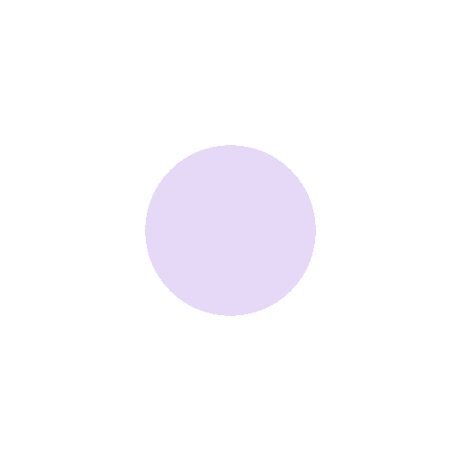 <code>circulo.png</code></td><td align="center">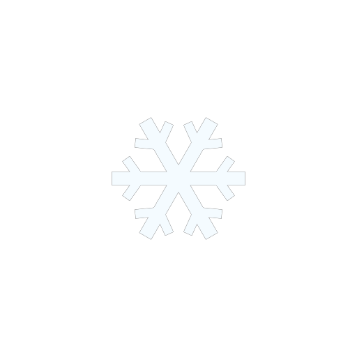 <code>copo.png</code></td><td align="center">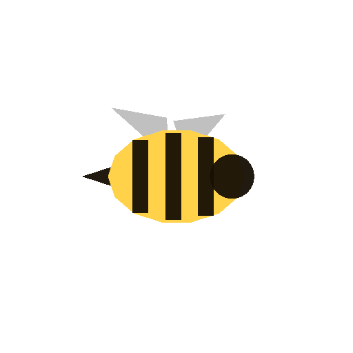 <code>abeja.png</code></td><td align="center">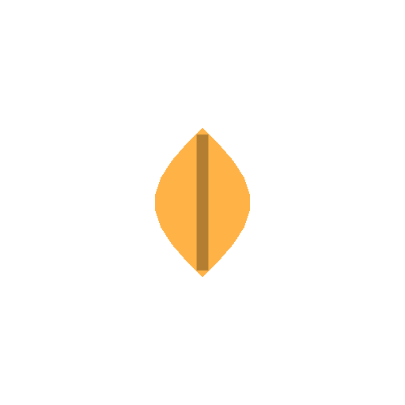 <code>hoja.png</code></td></tr>
<tr><td align="center"> <code>bola_1.png</code></td><td align="center">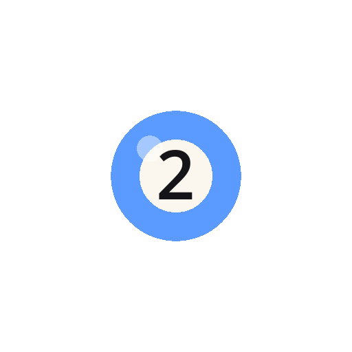 <code>bola_2.png</code></td><td align="center">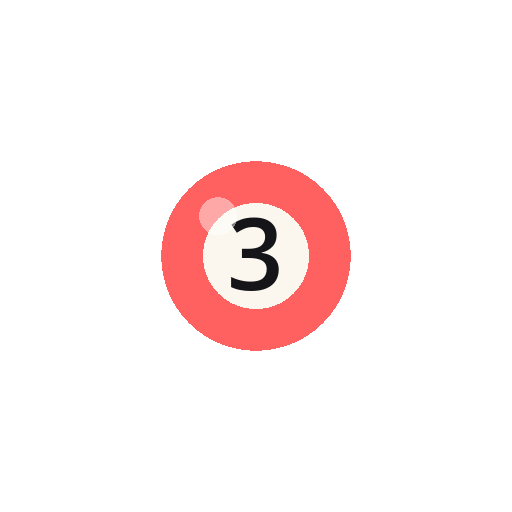 <code>bola_3.png</code></td><td align="center"> <code>bola_4.png</code></td></tr>
<tr><td align="center"> <code>bola_5.png</code></td><td align="center"> <code>bola_6.png</code></td><td align="center">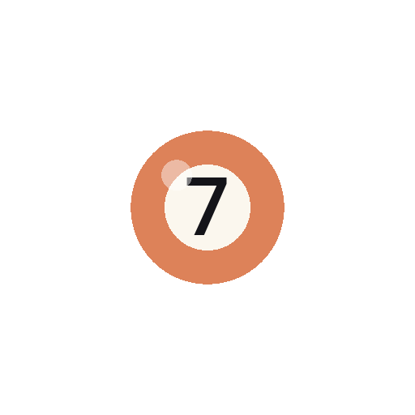 <code>bola_7.png</code></td><td align="center"> <code>bola_8.png</code></td></tr>
<tr><td align="center">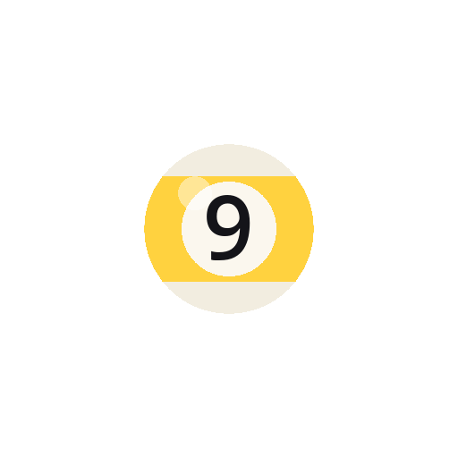 <code>bola_9.png</code></td><td align="center">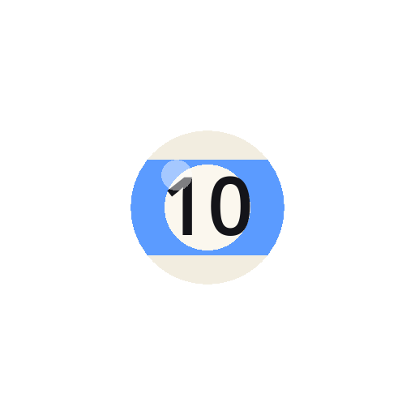 <code>bola_10.png</code></td><td align="center">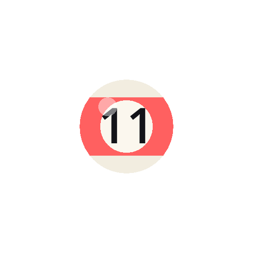 <code>bola_11.png</code></td><td align="center">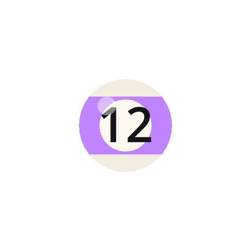 <code>bola_12.png</code></td></tr>
<tr><td align="center">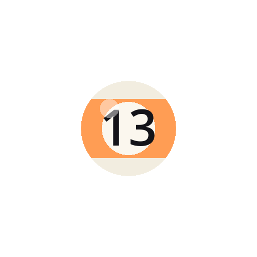 <code>bola_13.png</code></td><td align="center">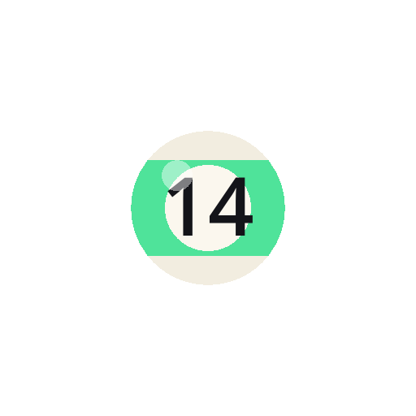 <code>bola_14.png</code></td><td align="center">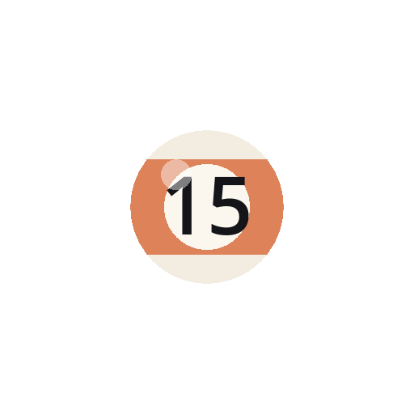 <code>bola_15.png</code></td><td align="center"> <code>dron.png</code></td></tr>
<tr><td align="center"> <code>chispa.png</code></td><td align="center">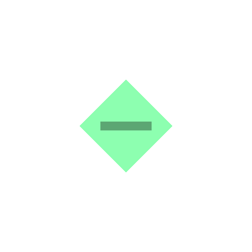 <code>chip.png</code></td><td align="center">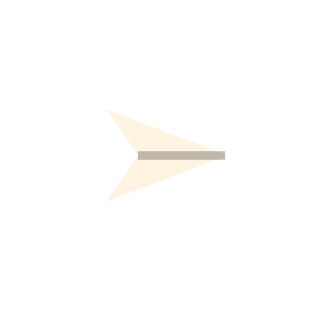 <code>avion.png</code></td><td align="center">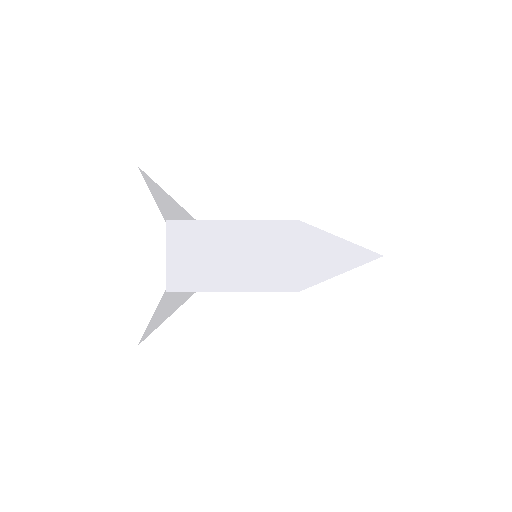 <code>misil.png</code></td></tr>
<tr><td align="center">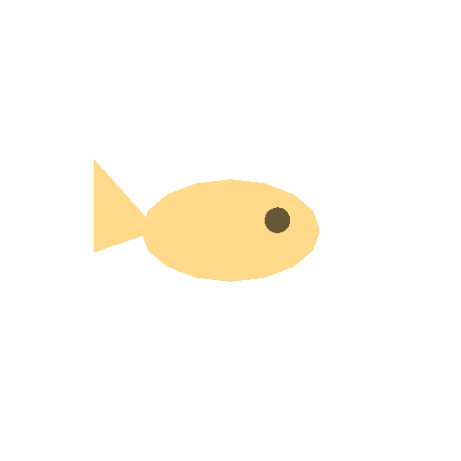 <code>pez.png</code></td><td align="center">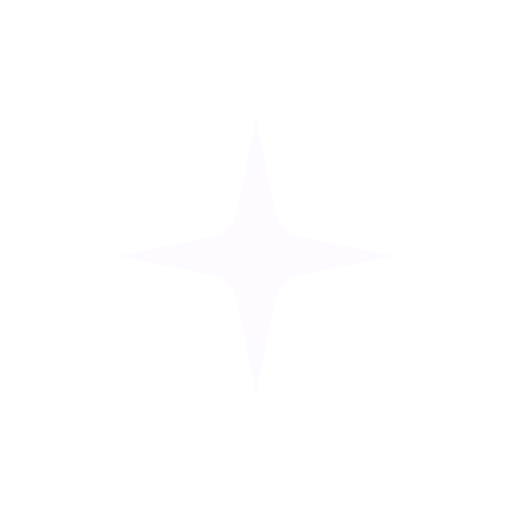 <code>estrella.png</code></td><td align="center">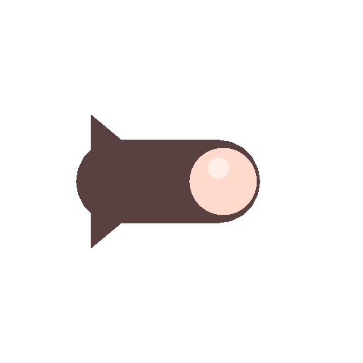 <code>bala.png</code></td><td align="center">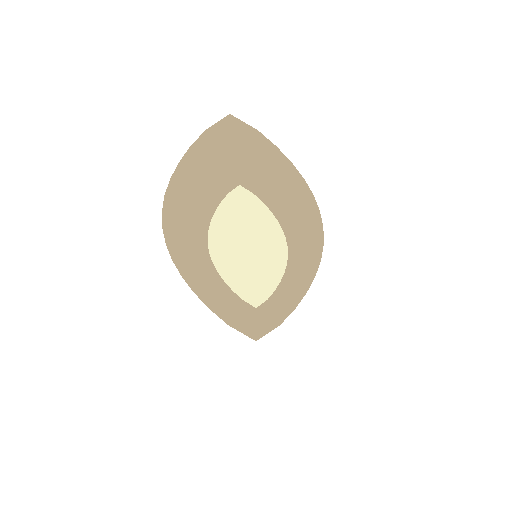 <code>llama.png</code></td></tr>
<tr><td align="center">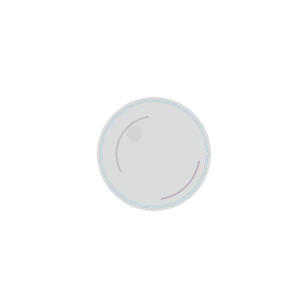 <code>burbuja.png</code></td><td align="center">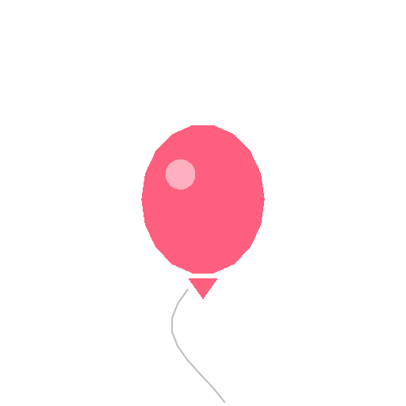 <code>globo_1.png</code></td><td align="center">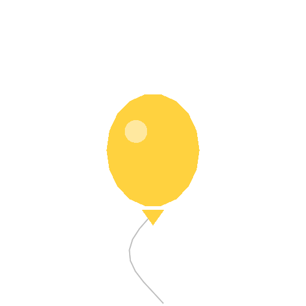 <code>globo_2.png</code></td><td align="center">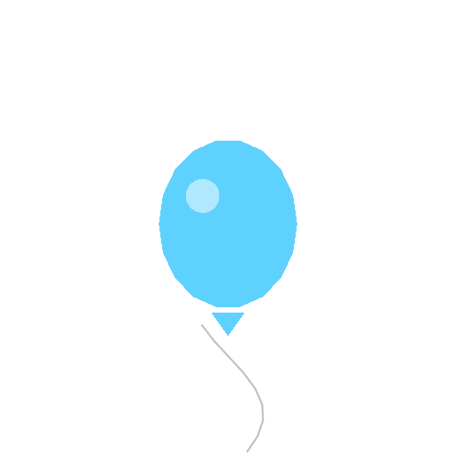 <code>globo_3.png</code></td></tr>
<tr><td align="center">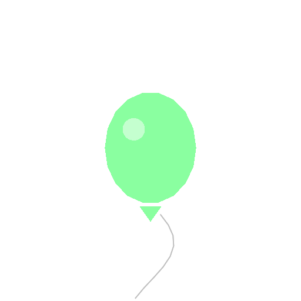 <code>globo_4.png</code></td><td align="center">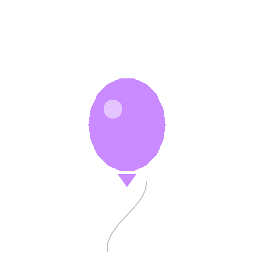 <code>globo_5.png</code></td><td align="center">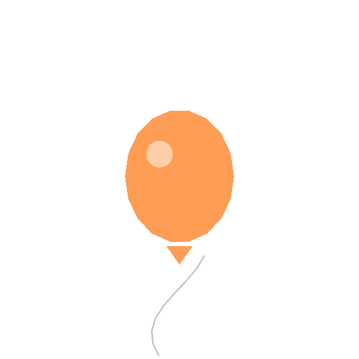 <code>globo_6.png</code></td><td align="center">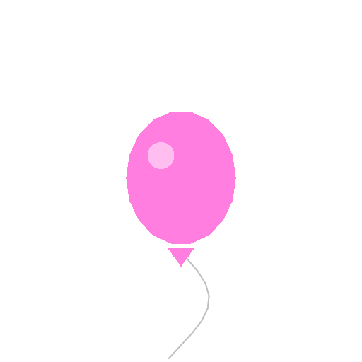 <code>globo_7.png</code></td></tr>
<tr><td align="center"> <code>globo_8.png</code></td></tr>
</table>

## Fondos

Se repiten en mosaico, así que **tienen que casar consigo mismos**: una
imagen que no encaje deja una rejilla de costuras por toda la pantalla.
Salen aquí ya compuestos sobre el color de su bioma, que es como se ven.

<table>
<tr><td align="center"> <code>estrellas.png</code></td><td align="center"> <code>copos.png</code></td><td align="center">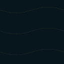 <code>corriente.png</code></td><td align="center">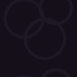 <code>celulas.png</code></td></tr>
<tr><td align="center"> <code>tapete.png</code></td><td align="center">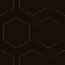 <code>panal.png</code></td><td align="center">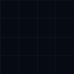 <code>rejilla.png</code></td><td align="center">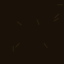 <code>hojas.png</code></td></tr>
<tr><td align="center">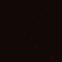 <code>pavesas.png</code></td><td align="center">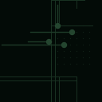 <code>trazas.png</code></td><td align="center"> <code>estelas.png</code></td><td align="center">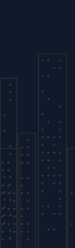 <code>horizonte.png</code></td></tr>
<tr><td align="center">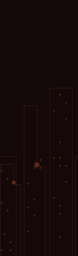 <code>horizonte_roto.png</code></td><td align="center">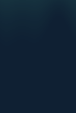 <code>aurora.png</code></td><td align="center">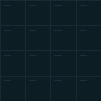 <code>azulejos.png</code></td><td align="center">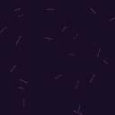 <code>confeti.png</code></td></tr>
<tr><td align="center">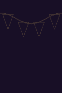 <code>banderines.png</code></td></tr>
</table>

## Paletas por bioma

| Bioma | Forma | Objetivo | Onda | Fondo |
|---|---|---|---|---|
| Cielo abierto | `estrella` | `#fdfbff` | `#8ec5ff` | `#070b16` |
| Invierno | `copo` | `#f4fbff` | `#8fd8ff` | `#0f2033` |
| Río | `pez` | `#ffd98a` | `#2fd6c0` | `#07161c` |
| Enjambre | `circulo` | `#e6d8f7` | `#b45cff` | `#150f1a` |
| Billar | `bola` | `#fff8e4` | `#ffc24d` | `#0a2717` |
| Panal | `abeja` | `#ffd24a` | `#ff8c1a` | `#17100a` |
| Estampida | `dron` | `#6feaff` | `#ff3b30` | `#060a12` |
| Otoño | `hoja` | `#ffb347` | `#ff7038` | `#1a1208` |
| Brasas | `llama` | `#ffca6b` | `#ff5a1f` | `#120806` |
| Circuito | `chip` | `#8dffb0` | `#34ff88` | `#030b07` |
| Ciudad de papel | `avion` | `#fff4e2` | `#ffd166` | `#101a2b` |
| Ducha | `burbuja` | `#d9f7ff` | `#7fe3ff` | `#0c1d24` |
| Fiesta | `globo` | `#ff8ad0` | `#ff5fd0` | `#180f26` |
| Asedio | `bala` | `#ffd9cc` | `#ff4530` | `#140809` |

